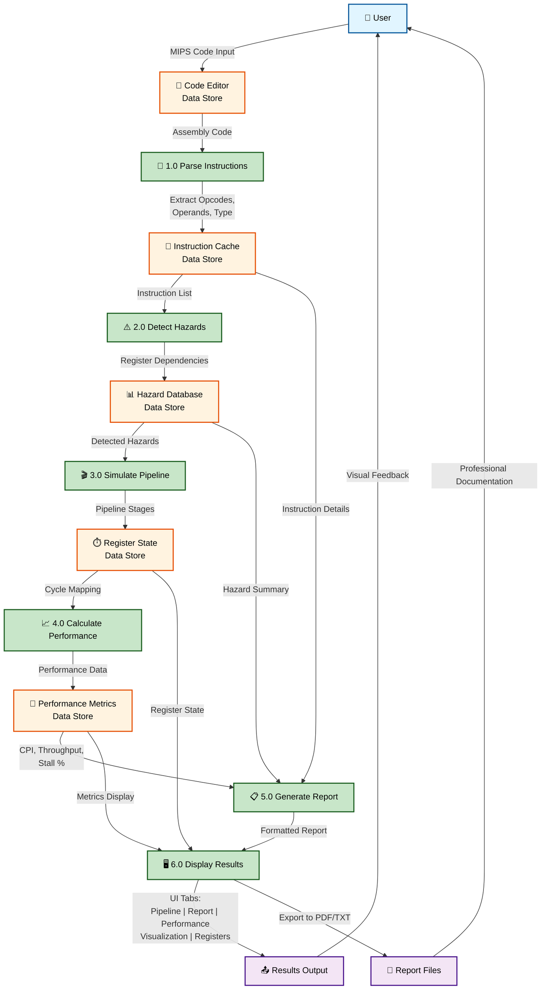

# MIPS Hazard Analyzer - Data Flow Diagram (Mermaid)

```mermaid
graph TD
    A["👤 User"] -->|"MIPS Code Input"| B["📝 Code Editor<br/>Data Store"]
    B -->|"Assembly Code"| C["🔧 1.0 Parse Instructions"]
    
    C -->|"Extract Opcodes,<br/>Operands, Type"| D["💾 Instruction Cache<br/>Data Store"]
    
    D -->|"Instruction List"| E["⚠️ 2.0 Detect Hazards"]
    
    E -->|"Register Dependencies"| F["📊 Hazard Database<br/>Data Store"]
    F -->|"Detected Hazards"| G["🎬 3.0 Simulate Pipeline"]
    
    G -->|"Pipeline Stages"| H["⏱️ Register State<br/>Data Store"]
    H -->|"Cycle Mapping"| I["📈 4.0 Calculate Performance"]
    
    I -->|"Performance Data"| J["🎯 Performance Metrics<br/>Data Store"]
    
    J -->|"CPI, Throughput,<br/>Stall %"| K["📋 5.0 Generate Report"]
    F -->|"Hazard Summary"| K
    D -->|"Instruction Details"| K
    
    K -->|"Formatted Report"| L["🖥️ 6.0 Display Results"]
    J -->|"Metrics Display"| L
    H -->|"Register State"| L
    
    L -->|"UI Tabs:<br/>Pipeline | Report | Performance<br/>Visualization | Registers"| M["📤 Results Output"]
    
    M -->|"Visual Feedback"| A
    L -->|"Export to PDF/TXT"| N["📄 Report Files"]
    N -->|"Professional Documentation"| A
    
    style A fill:#E1F5FF,stroke:#01579B,stroke-width:2px,color:#000
    style B fill:#FFF3E0,stroke:#E65100,stroke-width:2px,color:#000
    style D fill:#FFF3E0,stroke:#E65100,stroke-width:2px,color:#000
    style F fill:#FFF3E0,stroke:#E65100,stroke-width:2px,color:#000
    style H fill:#FFF3E0,stroke:#E65100,stroke-width:2px,color:#000
    style J fill:#FFF3E0,stroke:#E65100,stroke-width:2px,color:#000
    
    style C fill:#C8E6C9,stroke:#1B5E20,stroke-width:2px,color:#000
    style E fill:#C8E6C9,stroke:#1B5E20,stroke-width:2px,color:#000
    style G fill:#C8E6C9,stroke:#1B5E20,stroke-width:2px,color:#000
    style I fill:#C8E6C9,stroke:#1B5E20,stroke-width:2px,color:#000
    style K fill:#C8E6C9,stroke:#1B5E20,stroke-width:2px,color:#000
    style L fill:#C8E6C9,stroke:#1B5E20,stroke-width:2px,color:#000
    
    style M fill:#F3E5F5,stroke:#4A148C,stroke-width:2px,color:#000
    style N fill:#F3E5F5,stroke:#4A148C,stroke-width:2px,color:#000
```

---

