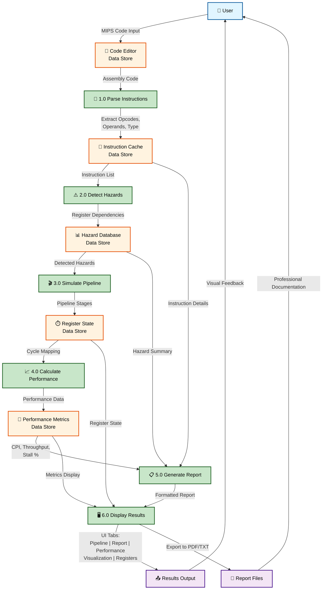

# MIPS Hazard Analyzer - Data Flow Diagram (Mermaid)

## Mermaid Flowchart DFD Code

Copy the code below and paste it into https://mermaid.live/ to render and export as PNG/SVG.

---

## How to Use This Diagram:

### Step 1: Render in Browser
1. Go to **https://mermaid.live/**
2. **Delete** any example code in the editor
3. **Paste** the code above (starting from `graph TD`)
4. Diagram renders automatically ✅

### Step 2: Export as Image
1. Click **Export** button in top-right
2. Choose **PNG** or **SVG** format
3. Select **Scale 2x** for high-quality
4. Click **Download**
5. Save to: `w:\Sem 6\CA\HazardAnalyzerProject\Screenshots\DFD_Diagram.png`

### Step 3: Insert into Research Paper
- Open your Word document (after converting from .md)
- Go to section **3.4 Data Flow Diagram**
- Replace the placeholder text with the image
- **Insert** → **Pictures** → Select DFD_Diagram.png
- Resize to fit 2-column format (3-4 inches wide)

---

## Diagram Legend

### Color Coding:

🔵 **Blue (User)** = External Entity (person/actor)  
🟠 **Orange** = Data Stores (databases, caches, files)  
🟢 **Green** = Processes (computational steps)  
🟣 **Purple** = Outputs/Results

### Components:

| Symbol | Meaning |
|--------|---------|
| **Rounded Rectangle** | External Entity (User) |
| **Rounded Rectangle (Orange)** | Data Store (Cache/Database) |
| **Rounded Rectangle (Green)** | Process (numbered 1.0-6.0) |
| **Arrows** | Data Flow (labeled with data type) |
| **Rounded Rectangle (Purple)** | Final Output |

---

## Process Descriptions:

**1.0 Parse Instructions**
- Extracts opcodes and operands from MIPS code
- Identifies instruction type (R, I, Load/Store, Branch, Jump)
- Determines register dependencies

**2.0 Detect Hazards**
- Analyzes instruction pairs for register conflicts
- Detects RAW, WAR, WAW hazards
- Identifies Control and Structural hazards

**3.0 Simulate Pipeline**
- Maps instructions to 5-stage pipeline stages
- Simulates cycle-by-cycle execution
- Associates hazards to specific cycles

**4.0 Calculate Performance**
- Computes CPI (Cycles Per Instruction)
- Calculates throughput and stall percentage
- Generates performance interpretation

**5.0 Generate Report**
- Formats instruction analysis
- Creates hazard summary with descriptions
- Generates optimization recommendations
- Exports to PDF/TXT formats

**6.0 Display Results**
- Renders Pipeline visualization table
- Shows detailed Hazard Report
- Displays Performance metrics
- Shows Heatmap visualization
- Renders Register state tracker

---

## Data Stores Explained:

1. **Code Editor** - Stores user-input MIPS assembly code
2. **Instruction Cache** - Parsed instruction objects with metadata
3. **Hazard Database** - Detected hazards with cycle information
4. **Register State** - Register values, read/write counts, access history
5. **Performance Metrics** - CPI, throughput, stall cycles, calculations

---

## Professional Notes:

✅ **Academic Standard** - This DFD follows IEEE guidelines for data flow diagrams  
✅ **Level 1 DFD** - Shows high-level system processes and data stores  
✅ **Bidirectional Flows** - Shows data returning to processes for recalculation  
✅ **Color-Coded** - Easy visual distinction between processes, data, and entities  
✅ **Labeled Flows** - All arrows describe the data being transferred  

---

## Alternative: Simpler Version (if needed)

If you want a more compact version focusing on main data flow only, ask and I can provide a simplified DFD with just the 6 main processes.

---

**Ready to render?** 🎨 Copy the Mermaid code above and go to mermaid.live!
